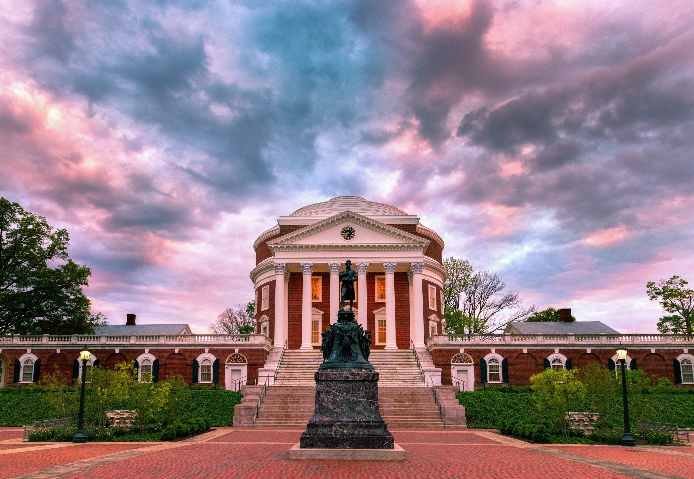

## Introduction
### Hi there :smiley:
My name is Daniel and I am a software engineer working on something cool!

## Background
I graduated from the University of Virginia with a Bachelor's in Computer Science in 2022. After graduating, I worked at Amazon Web Services for a year and a half as a Software Development Engineer but ended up leaving to take care of family. I am currently in the job market eagerly looking to resume my career!

## Interests
If I were to describe my ideal day, I would wake up early and go on a run or hit the gym. Afterwards, I would shower and do some light reading as I prepare for my day. I would go to a local coffee shop where I would spend my time working, hopefully building something--whether that be a mobile application or a website or what have you. And finally, I would end my day with a nice session of golf with some friends.

## Projects
Stay tuned! It'll be really cool...hopefully

  

